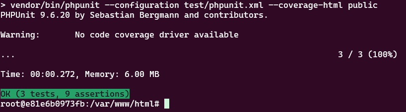

## Launching

- Clone repository
- `cd sky-php` - go to project directory
- `./install.sh` or `./start.sh` - run docker containers for project: PHP 
- `docker ps` - find running PHP container name, f.e.: `sky-php-php-1`
- `docker exec -it sky-php-php-1 bash` - go inside of container
- run `composer install`
- `./stop.sh` - to stop containers, if it needs

## Testing

- Inside of PHP container: `composer run test`

